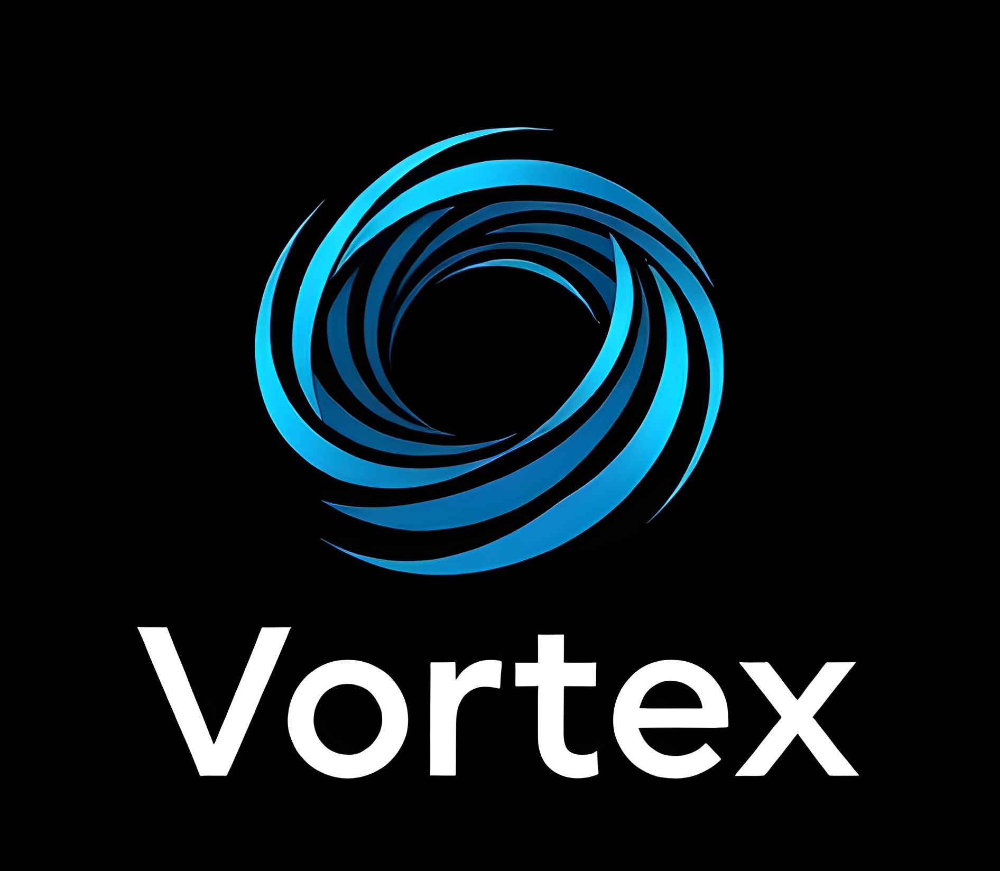

<p align="center">
   
</p>

[](https://bundlephobia.com/result?p=vortex)
[](https://www.npmjs.com/package/@vegajs/vortex)
[](https://www.npmjs.com/package/@vegajs/vortex)
 
# Vortex

**Vortex** is a powerful, flexible, and typed state management solution for TypeScript and JavaScript projects. It provides a reactive, event-driven architecture with support for dependency injection, computed properties, plugins, and a strong focus on type safety.

- **Type-safe**: No `any` types, ensuring you have full control over your state and actions with TypeScript.
- **Minimal re-renders**: Components only re-render when necessary, improving performance.
- **Framework-agnostic**: Works seamlessly with React, Vue, or any other framework.
- **Extensible**: Supports plugins and middleware for additional functionality.
- **Flexible and Scalable**: Can be used in small projects or large enterprise applications.

## Installation

```bash
npm i @vegajs/vortex
```

## Creating a Store

Your store in Vortex is fully typed and supports computed properties, reactive state, and effects.

```typescript
import { defineStore } from '@vegajs/vortex';

export const counterStore = defineStore(({ reactive, computed, effect }) => {
  const count = reactive(0);
  const doubleCount = computed(() => count.get() * 2);

  effect(() => {
    console.log(`Count is: ${count.get()}`);
  });

  const increment = () => {
    count.set((prev) => prev + 1);
  };

  return { count, doubleCount, increment };
});
```

## Using the Store in Components

You can use the store anywhere in your app. Since Vortex is framework-agnostic, you are not required to wrap your app in context providers. Here's how it works in React, but the pattern is similar for other frameworks.

```jsx
import { useStore } from '@vegajs/vortex';
import { counterStore } from './stores/counter';

function Counter() {
  const { count, increment } = useStore(counterStore);

  return (
    <div>
      <p>Count: {count}</p>
      <button onClick={increment}>Increment</button>
    </div>
  );
}
```

## Dependency Injection (DI)

Vortex supports Dependency Injection (DI) out of the box, allowing you to easily manage external dependencies like API services or logging utilities.

```typescript
import { defineStore, DIContainer } from '@vegajs/vortex';

export const createAppStore = () => {
  // Define your DI container
  const container = new DIContainer<{ logeer: Console }>();

  container.register('logger', console);
  
  return defineStore(
    ({ reactive, DI }) => {
      const count = reactive(0);
      const logger = DI.get('logger'); // Type Safety

      const increment = () => {
        count.set((prev) => prev + 1);
        logger.log('Count incremented');
      };

      return { count, increment };
    },
    { DI: container }
  );
};

export const appStore = createAppStore()
```

## Plugins and Extensibility

Vortex allows you to extend its functionality with plugins, like persistence.

```typescript
import { defineStore, persistPlugin } from '@vegajs/vortex';

export const counterStore = defineStore(({ reactive }) => {
    const count = reactive(0);

    const increment = () => {
      count.set((prev) => prev + 1);
    };

    return { count, increment };
  },
  { plugins: [persistPlugin('counterStore')] }
);
```

## Why Choose Vortex?

- **Type Safety**: Every state and action is fully typed, making it easy to catch mistakes during development.
- **Reactive**: Vortex provides a reactive state management system, automatically tracking dependencies and updating your app when the state changes.
- **Minimal Re-renders**: Only the components that depend on the changed state will re-render, avoiding unnecessary updates.
- **Framework-agnostic**: Vortex can be used in any front-end framework or even in Node.js environments.
- **Extensible**: With support for plugins, Vortex is easy to extend with additional features like persistence or logging.

## Comparison with Other Libraries

- **Vortex vs Redux**: Vortex requires less boilerplate and offers a more streamlined, type-safe experience.
- **Vortex vs Context API**: Vortex avoids the issues of over-rendering that can occur with the Context API by providing more granular control over state changes.

## API Reference

### `defineStore(setup, options?)`

Creates a new store with reactive state, computed properties, and effects.

- `setup`: A function that receives helpers (`reactive`, `computed`, `effect`, and optionally `DI`).
- `options`: An optional object that can include plugins and DI (dependency injection).

### `reactive(initialValue)`

Creates a reactive state that tracks changes and updates components.

### `computed(fn)`

Creates a computed property that updates when its dependencies change.

### `effect(fn)`

Defines a reactive effect that runs when its dependencies change.

### `DIContainer`

A container for managing dependencies, allowing you to inject external services into your store.

## Performance

Vortex is designed to minimize re-renders and optimize performance by updating only the components that depend on the changed state. This makes it suitable for both small and large-scale applications.

## License

MIT
